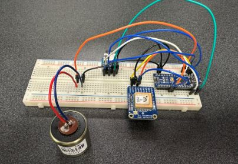

# Wireless-Geophone
An Open Source wireless geophone design built in parallel with SPECIES

The wireless geophone system being developed.

## License
This work is licensed under a
[Creative Commons Attribution-ShareAlike 4.0 International License][cc-by-sa].

